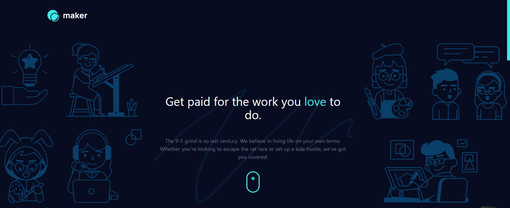

# MAKER PRE LANDING PAGE

## Links

- [GitHub](https://github.com/sukanyagurav/Maker-pre-launch-landing-page)
- [Live URL](https://maker5867.netlify.app/)

    <h2> Tech stack used</h2>

 
 

## Overview
Users should be able to:

- View the optimal layout depending on their device's screen size
- See hover states for interactive elements
- Receive an error message when the form is submitted if:
    - The Email address field is empty should show "Please enter your email"
    - The email is not formatted correctly should show "Thank you for subscribing!"
- Bonus Feature
   - The subscriber will receive the welcome email.

## Author
Frontend Mentor - [@sukanyagurav](https://www.frontendmentor.io/profile/sukanyagurav) 